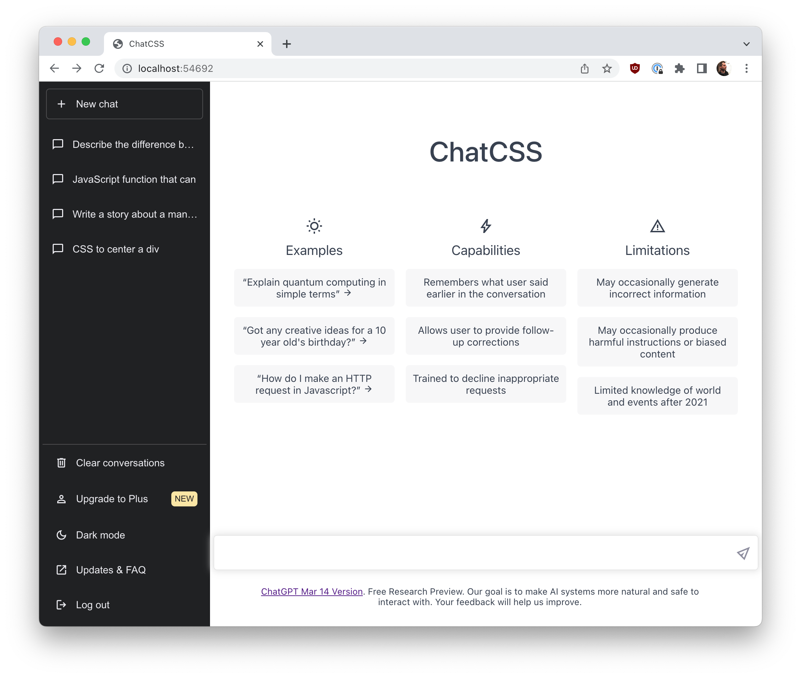

# ChatCSS



Rebuilding ChatGPT in CSS, focusing on CSS Box Model, Grid, Flexbox.

## Setup

```
npm install
npm start
```

Open your browser to http://localhost:1234

## Styles

Empty style files are located in [styles/](styles) along with `*.completed.css` versions, which have the finished code.

1. `common.css` - styles for `html`, `body`
2. `menu.css` - styles for the side menu
3. `chat.css` - styles for the main chat area
4. `prompt-response.css` - styles for `chat.html` to show a user prompt and response

There is lots more that we could do, but this focuses on the topics for [WEB222 Week 09](https://web222.ca/weeks/week09/).
